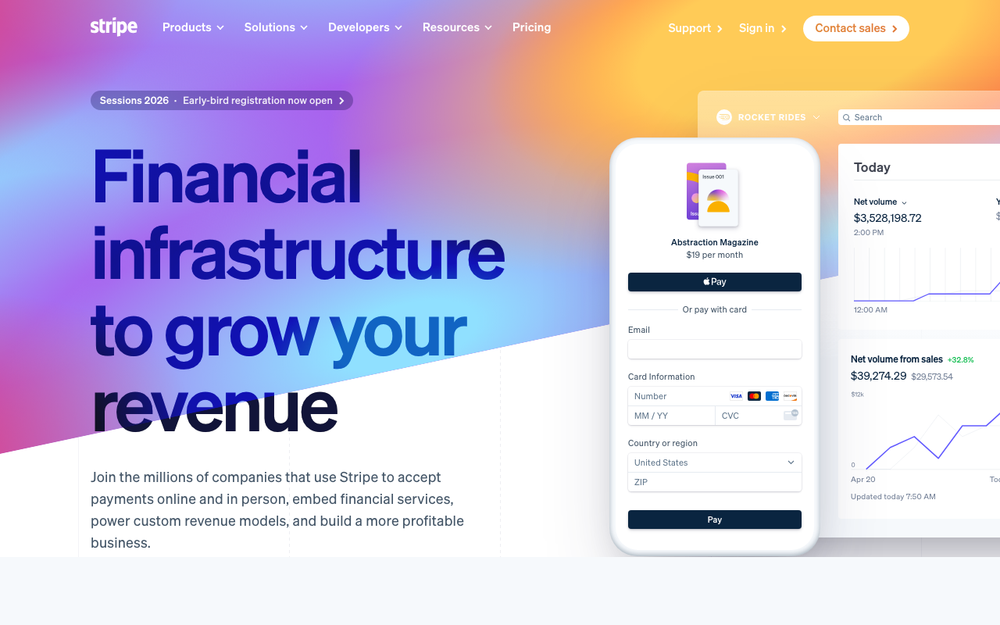
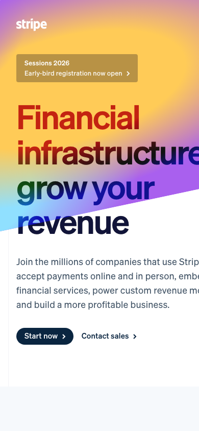

# ClaudeShot

A screenshot plugin for Claude Code. Takes screenshots of your screen or any webpage and brings them into your conversation.

I built this because I kept wanting Claude to see what I was looking at - error messages, UI bugs, designs I wanted to replicate. Now I can just `/screenshot` and it's in the conversation.

## What it does

- **Screen capture** - grab a region, window, or your whole screen
- **Web screenshots** - point it at any URL and get a full-page capture
- **DOM capture** - save page HTML alongside screenshots for debugging
- **Auto-resize** - shrink images to save tokens (a 217K screenshot becomes 11K)
- **JPEG support** - `--jpeg` for even smaller files

## Why ClaudeShot over Playwright?

If you have Playwright MCP installed, you might wonder why use this instead. The short answer: **dramatically fewer tokens**.

| What happens | ClaudeShot | Playwright MCP |
|--------------|------------|----------------|
| Take screenshot | Returns file path (45 bytes) | Returns base64 image inline (**524 KB**) |
| Response overhead | ~15 tokens | ~150+ tokens + huge image blob |
| Browser state | None (stateless) | Persists in memory |

**Actual benchmark** (screenshotting example.com):
- ClaudeShot response: `45 bytes`
- Playwright response: `524,800 bytes`

That's **99.99% less response overhead** for the screenshot step. The image tokens are the same when you view it, but Playwright returns the entire image inline as base64 while ClaudeShot just gives you a file path.

**Use ClaudeShot for:**
- Quick "does it look right?" checks
- Capturing reference designs
- Iterative build-screenshot-fix loops
- Anywhere token efficiency matters

**Use Playwright for:**
- Interactive testing (clicking buttons, filling forms)
- Multi-step browser automation
- Waiting for specific elements
- Testing JavaScript-heavy interactions

See [benchmarks/token-comparison.md](benchmarks/token-comparison.md) for the full breakdown.

## Example output

Desktop (1280px):



Mobile (390px):



Tablet (768px):


## Install

From Claude Code:

```
/plugin marketplace add naieum/claudeshot
/plugin install claudeshot@claudeshot-marketplace
```

Or manually:

```bash
git clone https://github.com/naieum/claudeshot.git ~/.claude-plugins/claudeshot
claude --plugin-dir ~/.claude-plugins/claudeshot
```

## Usage

Basic stuff:

```
/screenshot                  # select a region
/screenshot full             # whole screen
/screenshot window           # click a window
```

Web pages:

```
/screenshot --web http://localhost:3000
/screenshot --web https://stripe.com
```

To save tokens, add `--small` (1280px) or `--tiny` (640px):

```
/screenshot full --tiny
/screenshot --web http://localhost:3000 --small
```

The `--tiny` flag cuts file size by about 95%. Still readable, way fewer tokens.

## Examples

**Replicating a design**

I wanted a landing page similar to Stripe's. Instead of describing it:

```
/screenshot --web https://stripe.com --small
```

"Build me a hero section like this but for a developer tool."

Then check my work:

```
/screenshot --web http://localhost:3000 --small
```

"The spacing on the nav feels off. Can you fix it?"

**Debugging UI issues**

Something looks wrong but it's hard to describe:

```
/screenshot
```

Select the broken area and say "This dropdown is rendering behind the modal. Why?"

Way faster than trying to explain what's happening.

**Quick feedback loop**

When iterating on a component, I'll just keep screenshotting:

```
/screenshot --web http://localhost:3000/dashboard --tiny
```

"The sidebar is too wide. Also the icons aren't aligned."

Fix, screenshot again, repeat. The `--tiny` flag keeps token usage low so you can do this all day.

**Automated workflow**

You can ask Claude to screenshot and iterate without stopping:

"Build me a landing page. Screenshot it when you're done and fix any issues you see."

Claude will:
1. Build the page
2. Run `/screenshot --web http://localhost:3000 --small`
3. Look at the result
4. Fix problems and screenshot again

Works great for:
- "Make this look like stripe.com" (screenshots reference, builds, screenshots result, compares)
- "The layout is broken on mobile" (screenshots with `--mobile`, sees the issue, fixes it)
- "Style this form" (iterates until it looks right)

**Using a design reference**

Want to build something inspired by an existing site? Have Claude screenshot it first:

"Screenshot stripe.com and use it as a reference. Build me a similar hero section for my developer tool."

Claude will:
1. Screenshot the reference site
2. Analyze the layout, colors, spacing, typography
3. Build something similar for your project
4. Screenshot the result and compare

You can also save references for later:

```
/screenshot --web https://stripe.com -o examples/stripe-reference.png
```

Then tell Claude: "Use examples/stripe-reference.png as a design reference for this page."

**Testing mobile layouts**

Check how your site looks on phone and tablet:

```
/screenshot --web http://localhost:3000 --mobile
```

"The nav hamburger menu isn't showing. The breakpoint should kick in at this width."

```
/screenshot --web http://localhost:3000 --tablet
```

"Looks good on tablet but the cards should be 2 columns, not 3."

**Debugging with DOM capture**

When you need both the visual and the markup:

```
/screenshot --web http://localhost:3000 --dom
```

This saves both `screenshot.png` and `screenshot.html`. Useful when Claude needs to see the CSS issue visually and check the DOM structure at the same time.

## All the flags

```
--small           resize to 1280px width
--tiny            resize to 640px width
--resize WxH      custom size (e.g. --resize 800x600)
--jpeg            save as JPEG instead of PNG (smaller files)
--web URL         screenshot a webpage
--mobile          mobile viewport (390x844)
--tablet          tablet viewport (768x1024)
--viewport WxH    custom viewport (e.g., 375x667)
--fullpage        capture full scrollable page (default)
--web-viewport    just the visible viewport
--browser NAME    use specific browser (chrome, firefox, edge, safari)
--dom             capture page HTML alongside screenshot (web only)
-d, --delay N     wait N seconds before capture
-c, --clipboard   copy to clipboard too
-t, --tmp         save to /tmp instead of .claudeshots
```

Management:

```
/screenshot list    # show recent screenshots
/screenshot clear   # delete session screenshots
/screenshot open    # open the folder
```

## Configuration

If you want defaults, create `.claudeshot.conf` in your project:

```bash
RESIZE="1280"
WEB_WIDTH=1440
```

## Platform support

Works on macOS, Linux, and Windows.

- macOS uses the built-in `screencapture`
- Linux uses whatever you have installed (gnome-screenshot, scrot, maim, etc.)
- Windows uses PowerShell or Snipping Tool

Web screenshots support multiple browsers:
- Chrome/Chromium (default, best full-page support)
- Firefox (native `--screenshot` support)
- Edge (same as Chrome, Chromium-based)
- Safari (macOS only, limited - see note below)

**Safari note:** Apple never added headless screenshot support to Safari. Unlike every other browser, Safari has no `--headless --screenshot` option. We work around this with AppleScript, but it opens a visible Safari window briefly and can only capture the viewport (no full-page scroll capture). For headless screenshots, use Chrome or Firefox.

Auto-detects installed browsers. Use `--browser` to pick one:
```
/screenshot --web https://example.com --browser firefox
```

## Files

Screenshots go to `.claudeshots/` in your current directory. Add it to `.gitignore` if you don't want them in version control.

## Security

I wanted to make sure this thing couldn't accidentally nuke your project or system, so there are a bunch of safeguards:

- Can't write to system directories (`/etc`, `/usr`, `/bin`, etc.)
- Can't overwrite your dotfiles (`~/.bashrc`, `~/.zshrc`, etc.)
- Can't overwrite existing files outside `.claudeshots/` or `/tmp`
- Won't follow symlinks (if `.claudeshots` is a symlink, it refuses to use it)
- Only deletes actual `.png`/`.jpg` files in the expected locations
- Validates all inputs (URLs must be http/https, dimensions must be numbers, paths can't contain shell characters)
- Session log is capped at 1000 entries so it can't fill your disk

Basically, it can only write screenshots to `.claudeshots/` in your current directory or `/tmp`, and it can only delete files it created.

## License

MIT
